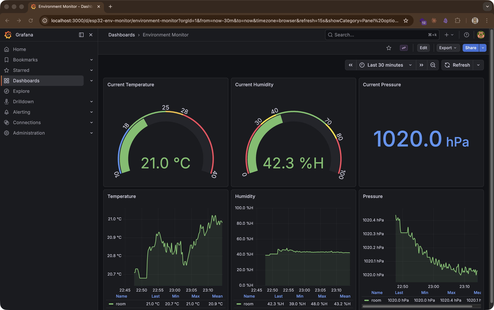
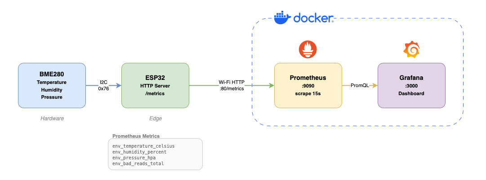
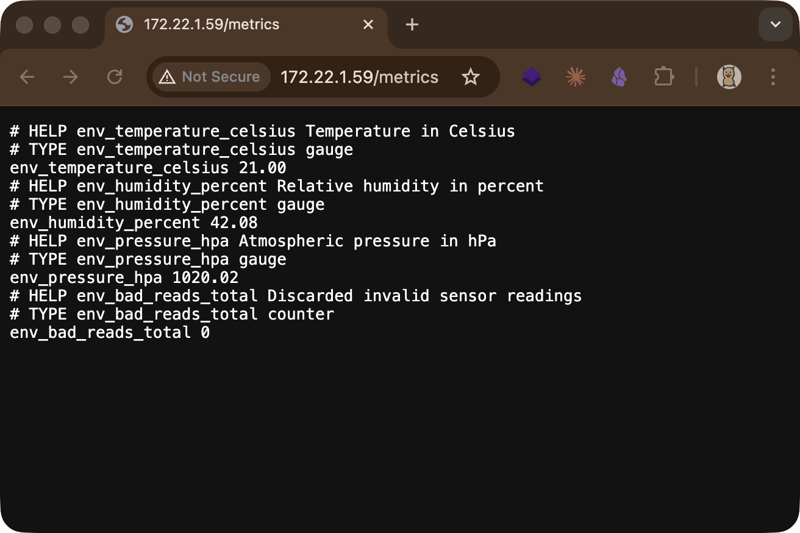

# IoT Environment Monitor

ESP32 + BME280 による環境モニタリングシステム。
温度・湿度・気圧を取得し、Prometheus + Grafana で可視化する。



## System Architecture



## Prerequisites

| ツール | 用途 | インストール |
| -------- | ------ | ------------- |
| [Python 3](https://www.python.org/) | PlatformIO 実行環境 | OS に応じて |
| [PlatformIO CLI](https://platformio.org/) | ESP32 ビルド & 書き込み | `pip install platformio` |
| [Docker](https://www.docker.com/) | Prometheus / Grafana 実行 | 公式サイトから |

## Hardware

### 使用部品

| 部品 | 型番 |
| ----- | ------ |
| マイコン | ESP32 DevKitC (ESP-WROOM-32) |
| センサ | AE-BME280 (秋月電子) |
| その他 | ブレッドボード、ジャンパーワイヤ (オス-オス) × 適量、USB ケーブル |

### 配線 (I2C)

| BME280 | ESP32 | 信号 |
| -------- | ------- | ------ |
| VDD | 3V3 | 電源 3.3V |
| GND | GND | グランド |
| SDI | GPIO21 | SDA (I2C データ) |
| SCK | GPIO22 | SCL (I2C クロック) |
| CSB | 3V3 | I2C モード固定 |
| SDO | GND | アドレス 0x76 |

### ブレッドボード配線例


詳細は [docs/wiring.md](docs/wiring.md) を参照。

## Quick Start

### 1. PlatformIO をインストール

```bash
pip install platformio
```

### 2. ESP32 を USB 接続してポートを確認

```bash
ls /dev/cu.usb*
```

以下のようなデバイスが表示されれば認識 OK:

```plaintext
/dev/cu.usbserial-0001
```

何も出ない場合は USB ドライバが必要です (ボード裏面のチップ型番を確認):

| チップ | ドライバ | 認識されるデバイス名 |
| -------- | --------- | ------------------- |
| CP2102 | [Silicon Labs](https://www.silabs.com/developers/usb-to-uart-bridge-vcp-drivers) | `/dev/cu.SLAB_USBtoUART` |
| CH340 | [WCH](http://www.wch-ic.com/downloads/CH341SER_MAC_ZIP.html) | `/dev/cu.usbserial-*` |

### 3. Wi-Fi 設定

```bash
cp firmware/esp32/src/config.example.h firmware/esp32/src/config.h
```

`config.h` を編集して Wi-Fi の SSID とパスワードを入力:

```cpp
#define WIFI_SSID "your-ssid"
#define WIFI_PASS "your-password"
```

ESP32 は **2.4 GHz / WPA2** のみ対応です。5 GHz や WPA3 のネットワークには接続できません。

### 4. ファームウェアをビルド & 書き込み

```bash
cd firmware/esp32
pio run --target upload
```

初回実行時は ESP32 ツールチェーンやライブラリが自動ダウンロードされます (数分かかります)。

### 5. シリアルモニタで動作確認

```bash
pio device monitor
```

出力が出ない場合は ESP32 の **EN ボタン** を押してリセットしてください。正常な出力:

```plaintext
=== IoT Environment Monitor ===

Scanning I2C bus...
  Found device at 0x76
Scan complete: 1 device(s) found

BME280 initialized successfully.

Connecting to your-ssid..........
Connected! IP: 192.168.1.100

HTTP server started on port 80
  http://192.168.1.100/
  http://192.168.1.100/metrics

Temperature: 22.6 C | Humidity: 35.0 % | Pressure: 1019.6 hPa
```

終了するには `Ctrl + C` を押します。

### 6. メトリクス確認

ブラウザまたは curl でアクセス:

```bash
curl http://<ESP32のIP>/metrics
```



### 7. インフラ起動

```bash
cd infra
docker compose up -d
```

- Prometheus: http://localhost:9090
- Grafana: http://localhost:3000 (初期パスワード: `admin`)

## Troubleshooting

### I2C スキャンで `0 device(s) found`

配線を再確認してください:

- VDD → 3V3、GND → GND が接続されているか
- SDI (SDA) → GPIO21、SCK (SCL) → GPIO22 が正しいか
- CSB → 3V3 に接続されているか (未接続だと SPI モードになる)
- SDO → GND に接続されているか (アドレス 0x76 の選択)

### シリアルポートが見つからない

```bash
ls /dev/cu.*
```

`cu.Bluetooth-Incoming-Port` しか出ない場合、USB ドライバがインストールされていないか、ケーブルが充電専用の可能性があります。

## Project Structure

```plaintext
iot-env-monitor/
├── README.md
├── assets/                         # README 用画像
│   ├── dashboard.png
│   ├── metrics.png
│   └── breadboard.png
├── docs/
│   ├── wiring.md                   # 配線構成書
│   ├── architecture.md             # システム構成・開発フェーズ
│   └── images/
│       └── architecture.drawio     # draw.io 構成図 (編集可)
├── firmware/
│   └── esp32/
│       ├── README.md               # ファームウェア仕様・バリデーション
│       ├── platformio.ini          # PlatformIO 設定
│       └── src/
│           ├── main.cpp            # ファームウェア本体
│           ├── config.h            # Wi-Fi / IP 設定 (gitignored)
│           └── config.example.h    # config.h のテンプレート
└── infra/
    ├── docker-compose.yml          # Prometheus + Grafana
    ├── prometheus/
    │   └── prometheus.yml
    └── grafana/
        ├── dashboards/
        │   └── environment.json    # ダッシュボード定義
        └── provisioning/
            ├── dashboards/
            │   └── dashboards.yml
            └── datasources/
                └── prometheus.yml
```
