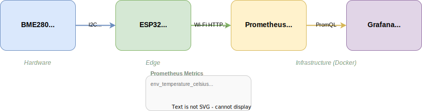

# システム構成 — IoT Environment Monitor

## 全体アーキテクチャ



## レイヤー構成

### 1. センサ層

| 項目 | 値 |
|------|-----|
| デバイス | BME280 (AE-BME280) |
| 測定項目 | 温度、湿度、気圧 |
| 通信 | I2C (0x76) |
| 電圧 | 3.3V |

### 2. エッジ層 (ESP32)

| 項目 | 値 |
|------|-----|
| デバイス | ESP32 DevKitC |
| 役割 | センサ読み取り → メトリクス公開 |
| 通信 (下流) | I2C マスター |
| 通信 (上流) | Wi-Fi HTTP (Prometheus exporter) |

ESP32 は HTTP エンドポイントで Prometheus 形式のメトリクスを公開する。

| エンドポイント | 内容 |
|--------------|------|
| `GET /` | ブラウザ用ダッシュボード (5 秒自動更新) |
| `GET /metrics` | Prometheus exposition format |

```
# HELP env_temperature_celsius Temperature in Celsius
# TYPE env_temperature_celsius gauge
env_temperature_celsius 25.3

# HELP env_humidity_percent Relative humidity in percent
# TYPE env_humidity_percent gauge
env_humidity_percent 48.2

# HELP env_pressure_hpa Atmospheric pressure in hPa
# TYPE env_pressure_hpa gauge
env_pressure_hpa 1013.25
```

### 3. 収集層 (Prometheus)

- ESP32 の `/metrics` を定期スクレイプ
- 時系列データとして保存

### 4. 可視化層 (Grafana)

- Prometheus をデータソースとして接続
- 温度・湿度・気圧のダッシュボード表示

## データフロー

```
BME280 → (I2C) → ESP32 → (HTTP /metrics) → Prometheus → Grafana
         ~10ms           scrape interval     query
                          (15s default)
```

## 開発フェーズ

| フェーズ | 内容 | 状態 |
|---------|------|------|
| Phase 0 | ハードウェア構成設計 | 完了 |
| Phase 1 | 配線 + I2C スキャン | 完了 |
| Phase 2 | センサ値取得ファームウェア | 完了 |
| Phase 3 | Wi-Fi + HTTP exporter | 完了 |
| Phase 4 | Prometheus + Grafana | 完了 |
